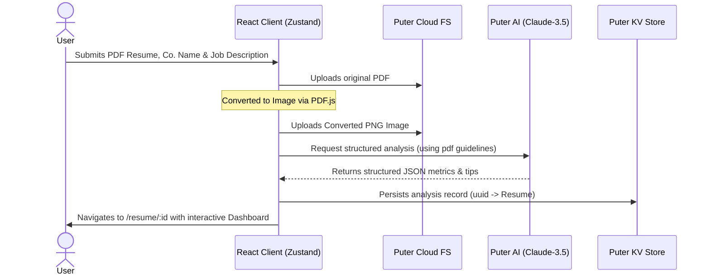

<div align="center">
  
  # 🎯 Resumind
  
  ### *AI-Powered Resume Analyzer & ATS Optimizer*
  
  [](https://ai-resume-analyzer-cursor.vercel.app/)
  [](LICENSE)
  [](https://react.dev)
  [](https://reactrouter.com)
  [](https://vitejs.dev)
  [](https://tailwindcss.com)

  **Empower your job hunt with smart, instant, and personalized feedback tailored to your dream jobs.**
  
  [🌐 Explore the Live App](https://ai-resume-analyzer-cursor.vercel.app/) | [📁 View Codebase](https://github.com/absharabi/ai-resume-analyzer)
  
</div>

---

## 💡 What is Resumind?

In today's highly competitive job market, **over 70% of resumes are filtered out by ATS (Applicant Tracking Systems)** before they ever reach human recruiters. 

**Resumind** is a modern, full-stack, single-page application built to level the playing field. By dropping your resume along with a target company, job title, and description, Resumind evaluates your application, scores it across multiple professional dimensions, and gives you actionable checklists to make your profile stand out to recruiters and pass modern scanner algorithms.

---

## ✨ Key Features

* **💼 Target Job Contextual Matching**: Tailors assessment based on target companies, role names, and specific job descriptions for precise relevance.
* **📈 Multi-Dimensional Score Gauges**:
  * **ATS Suitability**: Validates layouts, compliance, formatting, tables, and scanning ease.
  * **Tone & Style**: Checks tone level, reading flow, active voice usage, and professional style.
  * **Content Strength**: Reviews bullet points, performance metrics, and quantifiable impact.
  * **Structure**: Verifies visual hierarchy, section spacing, margins, and readability.
  * **Skills Matching**: Automatically matches your skill sets to job requirements and identifies key missing keywords.
* **⚡ Supercharged Serverless Flow**: Powered entirely by the **Puter.js** browser cloud SDK to run user authentication, file uploads, key-value storage, and Claude-powered AI feedback directly from the client.
* **🔍 Side-by-Side Canvas View**: Uploaded resumes are rendered to preview images in-browser, allowing users to scroll through their document alongside the AI feedbacks.
* **🌓 Theme Adaptability**: Toggle smoothly between Light and Dark mode interfaces.

---

## 🎨 System Architecture & Workflow

Here is how data flows securely and efficiently through **Resumind** when analyzing a resume:



---

## 🛠️ Technology Stack

| Layer | Technologies | Purpose |
| :--- | :--- | :--- |
| **Frontend Core** | **React 19**, **React Router v7**, **TypeScript** | Powers UI logic, routes, and strict type definitions. |
| **CSS & Design** | **Tailwind CSS v4**, **PostCSS**, **CSS Variables** | Responsive grids, beautiful glassmorphic gauges, and dark mode. |
| **State Store** | **Zustand** | Global stores to handle Puter.js initialization and auth state. |
| **AI & Backend** | **Puter.js SDK** (Claude Sonnet 4) | Serverless authentication, Cloud Filesystem, Database, and LLM orchestration. |
| **Compilation** | **Vite 6** | Extremely fast bundler with HMR support. |
| **Document Processing** | **pdfjs-dist**, **pdfkit** | Extracting pdf content and generating previews. |

---

## 🚀 Running the Project Locally

Follow these quick commands to spin up a local instance of the resume analyzer on your machine:

### 📋 Prerequisites
Ensure you have **Node.js** (v18+) and **npm** installed on your system.

### Option 1: Development Mode

1. **Clone the repository**:
   ```bash
   git clone https://github.com/absharabi/ai-resume-analyzer.git
   cd ai-resume-analyzer
   ```

2. **Install dependencies**:
   ```bash
   npm install
   ```

3. **Start the development server**:
   ```bash
   npm run dev
   ```

4. **Access the application**:
   Open [http://localhost:5173](http://localhost:5173) in your browser.

---

### Option 2: Production Build & Serve

To compile the application with full code-splitting and asset optimization for production:

1. **Build the application**:
   ```bash
   npm run build
   ```

2. **Start the local production server**:
   ```bash
   npm run start
   ```
   *The app is served at `http://localhost:3000` (or as configured in your runtime config).*

---

### Option 3: Running via Docker

If you prefer containerized testing:

1. **Build the Docker Image**:
   ```bash
   docker build -t ai-resume-analyzer .
   ```

2. **Run the Container**:
   ```bash
   docker run -p 3000:3000 ai-resume-analyzer
   ```

---

## 💼 Why Recruiters Will Love This Codebase

When evaluating this project, recruiters and hiring managers will appreciate:
* **Serverless Backend-less Architecture**: Avoids the complexity and cost of maintaining dedicated API servers. Auth, cloud database (KV), storage (FS), and AI LLM APIs are all completely orchestrated on the client via **Puter.js SDK** secure tokens.
* **Complex UI States & Polish**: Fine-grained transitions when loading, processing, and navigating. Modern accordion interfaces, interactive SVGs gauges, and theme toggling demonstrate strong CSS and React design chops.
* **TypeScript Rigor**: Strict interface compliance for raw data structures (such as `Feedback` schemas and client states).
* **Document Processing & Imaging Client-Side**: Leverages PDF libraries straight in the browser without delegating layout transformations or rendering to costly backend microservices.
